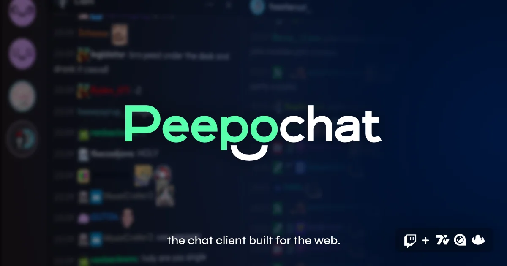

<div align="center">


# Peepochat
A fully-featured Twitch chat clilent that runs entirely within your browser.

</div>

## About this repo.

This project is a Twitch chat client that lives entirely within your browser. Complete with customizable layouts, pings, message history, and support for all of the third-party emote services like BetterTTV, FrankerFaceZ, and 7TV.

Intended to be a truly cross-platform chat client, the client is customizable and fully stored within the confines of your browser of choice.

- **Channels and splits** - the sidebar is where you switch between either **channels** or **splits**. Splits are groups of multiple channels that can be arranged in any way you see fit. Have a tightly knit group of friends that you want to keep an eye on? You can keep them all in one split to get a view at all of them.
- **Pings and notifications** - you're already going to keep the tab open, why not get properly notified when someone mentions your name or triggers keywords that you set? Maybe you want to get notifications for when one of the channels you're connected to goes live. You'll never miss a thing again!
- **Completely local** - all of your settings and layouts are stored locally in your browser. The app includes the same backup and restore feature from [Chatvoice](https://chatvoice.rcw.lol) so that you can quickly get back to a configuration and **actually own your data**.

You can view more of the history behind Peepochat and how it came to be over on my [website](https://rcw.lol/project/peepochat).

## How do I modify this?

This project is a heavily modified fork of [Chatvoice](https://github.com/rcwowo/chatvoice), and is built with React + Vite + TypeScript, as well as Tailwind.

To get up and running, make sure you've created a **public client type** app via the [Twitch developer console](https://dev.twitch.tv/console) in order to get a client ID. Make sure you add the necessary OAuth redirect URLs for your deployment.

```sh
# Clone the repo
git clone https://github.com/rcwowo/peepochat

# Install dependencies
cd peepochat && bun install

# Setup and add environment variables
cp .env.example .env

# Run the test server
bun dev
```

## Responsible disclosure!

Some assistance from LLM-models **have been used** in the process of this project. I have been [very vocal](https://tv.rcw.lol/watch/8650bd18-85da-4374-b54f-a470ac1752fe/?t=6178/) about the use of AI as a tool instead of being a replacement for human creativity. I also think that is my responsibility to disclose when these tools were used to help create a project.